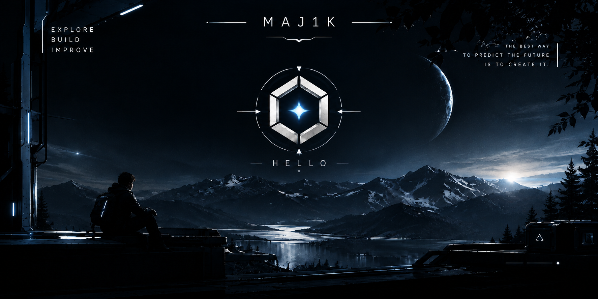
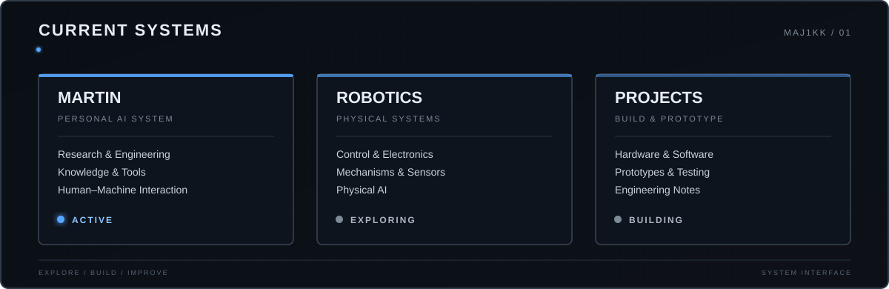

# MAJ1KK

### Engineering student · Robotics · AI · Electronics · Physics

*Understanding how things work — then building them.*

---

## 👋 About me

I'm an engineering student focused on robotics and the development of physical and intelligent systems.

My main interest lies at the intersection of **hardware, software and intelligence** — from electronics and embedded systems to robotics, artificial intelligence and human–machine interaction.

I like approaching problems from the fundamentals: understand the system, build a prototype, test the idea, find the weak points and improve it.

This GitHub is where I document that process — projects, experiments, engineering notes, prototypes and the things I learn along the way.

---

## ⚙️ Areas of interest

<table>
  <tr>
    <th>Field</th>
    <th>Focus</th>
  </tr>
  <tr>
    <td align="center"><b>🤖 Robotics</b></td>
    <td align="center">Robot systems, mechanisms, sensors and actuators</td>
  </tr>
  <tr>
    <td align="center"><b>🧠 Artificial Intelligence</b></td>
    <td align="center">AI, machine learning and physical AI</td>
  </tr>
  <tr>
    <td align="center"><b>🔌 Electronics</b></td>
    <td align="center">Circuits, sensors and hardware</td>
  </tr>
  <tr>
    <td align="center"><b>💻 Embedded Systems</b></td>
    <td align="center">Microcontrollers, firmware and real-time systems</td>
  </tr>
  <tr>
    <td align="center"><b>📐 Control Systems</b></td>
    <td align="center">Automation, feedback and motion control</td>
  </tr>
  <tr>
    <td align="center"><b>⚛️ Physics</b></td>
    <td align="center">Fundamentals, modelling and engineering applications</td>
  </tr>
  <tr>
    <td align="center"><b>🦾 Human–Machine</b></td>
    <td align="center">Interfaces, interaction and system integration</td>
  </tr>
  <tr>
    <td align="center"><b>🧬 Bio / Neuroengineering</b></td>
    <td align="center">BCI, neurotechnology and biological systems</td>
  </tr>
  <tr>
    <td align="center"><b>🛠️ Manufacturing</b></td>
    <td align="center">Prototyping, 3D printing and physical fabrication</td>
  </tr>
</table>

---

---

## 💻 Technologies & tools

### Languages

### Hardware & Embedded

### Tools

---

## 🚧 Projects

### 🤖 MARTIN

A personal research and engineering AI system built around research, knowledge organization, engineering workflows and interaction with tools and other AI systems.

The project brings together several areas I'm interested in:

- AI and software
- engineering and robotics
- research and information processing
- knowledge systems
- human–machine interaction

MARTIN is being developed as a long-term project, with the architecture evolving alongside the work.

---

## 📊 GitHub activity

 

---

## 🧭 How I work

### **learn → build → test → break → understand → improve → repeat**

I prefer hands-on work over keeping everything theoretical.

A failed prototype is useful if it explains **why** it failed.

The goal is to understand **why it works**.

---

### EXPLORE · BUILD · IMPROVE

